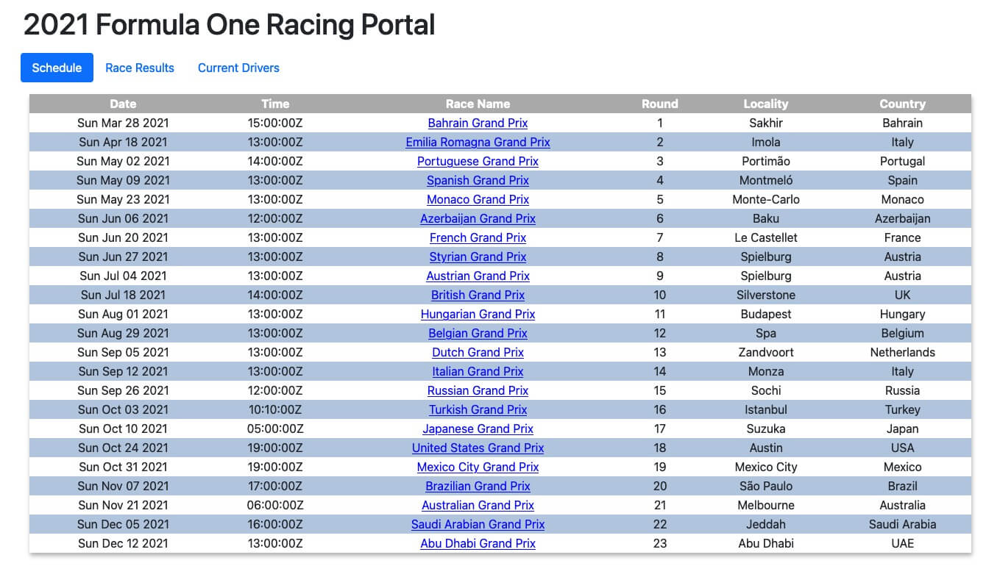

# Formula One Racing Portal

## Purpose

An API Challenge as part of the [Eleven Fifty Academy](https://elevenfifty.org/courses/part-time/web-development/) Web Development Bootcamp to earn the Gold Badge. The student will demonstrate understanding and ability to fetch data from an API, use DOM manipulation to tie JavaScript to HTML, and the ability to take the retrieved data to display to the screen.

## Instructions

Student is give a list of APIs to choose from to build a project. I selected the [Formula One Racing API](http://ergast.com/mrd/).

## Requirements

- Pull data from an API
- Utilize GET only
- Freedom to use Bootstrap, Flexbox, CSS Grid, etc.
- Make content visually appealing and professional

## Advanced Criteria Ratings

1. Fetch -- Abilty to deliver a bug-free project that correctly uses fetch to pull data from an approved API. Coder pushed themself to further their understanding of asynchronous code.

2. DOM Manipulation -- Successfully queried elements from teh DOM with a variety of methods and selectors, and created several different types of elements. After assigning data retrieved from the third party API, relationships between the newly created elements and DOM were established. The Coder demonstrated a great understanding of the DOM and pushed themself to further their understanding of the DOM.

3. CSS -- The project does an exemplary job of demonstrating HTML and CSS skills with its use of space and aesthics.

4. Deployed -- The application is deployed with GitHub Pages and can be accessed through the deployed link.

## Explaining My Application Build

Besides meeting the project requirements, I continued beyond those requirements to demonstrate the following skills and abilities:

- multiple fetch requests from the API to pull not one, but three distinct data sets with some of those data sets relaying on each other to display needed information

- skill and ability to create a local JSON with driver photos to pull into the application to give the user a better experience interacting with the app

- use of [Promises](https://developer.mozilla.org/en-US/docs/Web/JavaScript/Reference/Global_Objects/Promise) within the [map()](https://developer.mozilla.org/en-US/docs/Web/JavaScript/Reference/Global_Objects/Map) method to demonstrate the abilty to return multiple promises within a loop. To accomplish this task, I used the [Promise.all](https://developer.mozilla.org/en-US/docs/Web/JavaScript/Reference/Global_Objects/Promise/all)

- use of [Bootstrap](https://getbootstrap.com/) to help with layout and styling

- use of [ES6 modules](https://developer.mozilla.org/en-US/docs/Web/JavaScript/Guide/Modules) to demonstrate skill and ability using [@import](https://developer.mozilla.org/en-US/docs/Web/JavaScript/Reference/Statements/import) and [@export](https://developer.mozilla.org/en-US/docs/Web/JavaScript/Reference/Statements/export)

- use of ES6 modules compartmentalized the JS to make the code cleaner and easier to maintain

- skill and ability to use both [createElement](https://developer.mozilla.org/en-US/docs/Web/API/Document/createElement) and [template literals](https://developer.mozilla.org/en-US/docs/Web/JavaScript/Reference/Template_literals) to create elements containing the API data and display on the screen using the two methods [insertAdjacentHTML](https://developer.mozilla.org/en-US/docs/Web/API/Element/insertAdjacentHTML), [insertAdjacentElement](https://developer.mozilla.org/en-US/docs/Web/API/Element/insertAdjacentElement) and the property [innerHTML](https://developer.mozilla.org/en-US/docs/Web/API/Element/innerHTML).

## Application Screenshot

